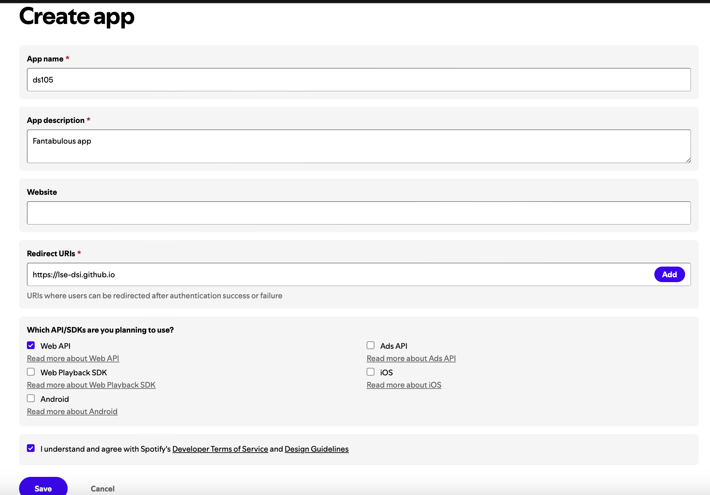

# Setup and auth for Spotify Web API

## Part I 
1. Create a Spotify Developer Account and read [the docs for the Client Credentials Flow](https://developer.spotify.com/documentation/web-api/tutorials/client-credentials-flow).

2. Create a new app with a name and a description. 


3. Get your client ID and client secret from the `Settings` page of your app. 

4. Set up your environment variables in a `.env` file at the root of the repository. The code below will copy the template file to a new `.env` file.

```bash
cp .env.template .env
```

## Part II
1. Create a `.gitignore` file (already present in this repo). 

2. Create a [virtual environment](https://www.freecodecamp.org/news/how-to-setup-virtual-environments-in-python/):

```bash
python3 -m venv venv
```
3. `pip install` the necessary packages: 

```bash
pip install requests python-dotenv pandas lets-plot
```

Test that the packages are installed correctly by running the following command:

```bash
pip list
```

4. Generate a `requirements.txt` file: 

```bash
pip freeze > requirements.txt
```

## Part III (see [`auth.py`](auth.py))

1. Load your environment variables into your Python script. 
2. Authenticate with Spotify and get a token
3. Make a request to the Spotify API using the token